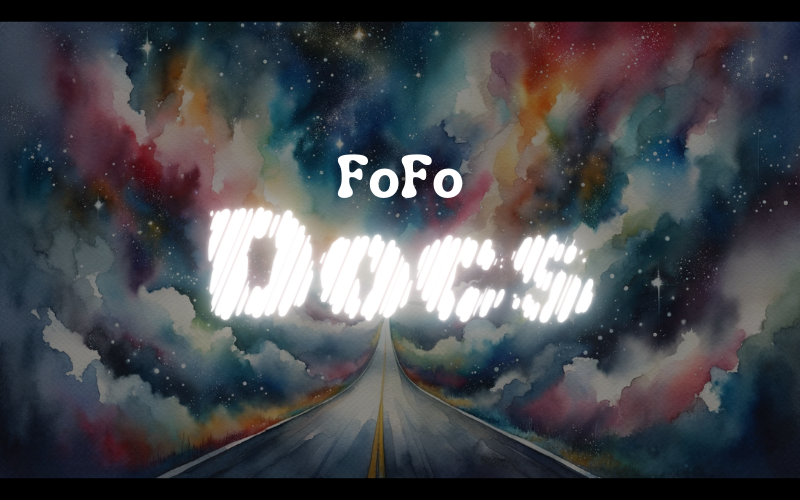

# FoFo Docs


Tool to generate user documentation for code repositories.

# Example Output:
[Example Output](example_docs/README.md)

## Roadmap 
- [ ] Create PoC
    - [ ] Implement LLM Support
        - [X] OpenAI
        - [X] Google Vertex API (Gemini Flash and Pro 1.5)
        - [X] Ollama (Select Models)
        - [ ] Other popular LLM backends
    - [ ] Implement Embedding Generation Support
        - [X] OpenAI
        - [X] Google Studio  
        - [ ] Ollama 
        - [ ] Other popular LLM backends
- [ ] Supported Languages:
    - [x] TypeScript / JavaScript
    - [ ] Python
    - [ ] TBA

# General To-Do List
- [ ] Change ChromeDB to use local storage by default
- [ ] Add ability to set pause between requests to avoid rate limiting; settable in .env
- [ ] Allow for custom glob patterns to be passed in for file selection via .fofoinclude file
- [ ] Batch API Calls to avoid rate limiting and speed up processing

# Getting Started:

NOTE: This project is still in development and is not yet ready for use. You can try, if you really want.

## Setup Dependencies
- Clone the repository
- CD into "client-app" and Run `npm install` to install dependencies
    - Ensure you have Node.js installed on your machine, and can call `npx` from the command line
- As of now, a ChromaDB server is used. In the future, this will be replaced with local storage and the option to use a server.
    - Example server located in the "sample_backend" directory
    - Otherwise you can follow the instructions here: [ChromaDB](https://docs.trychroma.com/deployment/aws#docker)

## Configure Environment
- Create a `.env` file in the client-app directory
- Fill out required ENV Variables
(Todo: Add ENV Variables List Here)

### .env Example:
```
# OPENAI AI Settings
OPENAI_API_KEY=
OPENAI_ORG_ID=

# Vertex AI / Gemini API Key
GEMINI_KEY=
GOOGLE_APPLICATION_CREDENTIALS=/path/to/googleServiceAccount.json

# // API Details for ChromaDB
API_URL=http://localhost:8000

# // OLLAMA Settings - USE IP ADDRESS OF MACHINE RUNNING OLLAMA
OLLAMA_SERVER_URL=http://<ollamaAPI_address>:11434

# // LLM to Use Options:

# OPENAI
# - gpt-4o

# OLLAMA
# - qwen:32b-text-v1.5-q4_0
# - phi3:latest
# - phi3:3.8b-mini-instruct-4k-fp16
# - dolphin-llama3:8b-v2.9-fp16
# - codeqwen:7b-code-v1.5-q8_0
# - llama3-gradient:8b-instruct-1048k-q6_K

# Google Vertex AI
# - gemini-1.5-flash-preview-0514
# - gemini-1.5-pro-preview-0514
# - codechat-bison
# - codechat-bison-32k

# - gpt-4o (OpenAI) / dolphin-llama3:8b-v2.9-fp16 (OLLLAMA) / gemini-1.5-pro-preview-0514 (Vertex AI)
#   are the best models in each class

LLM_TO_USE=gpt-4o

# // Other Settings
# - Set to true to enable the embedder mode: GCP or OPENAI
EMBEDDER_MODE=OPENAI

# 500 works really well for most models
MAX_TOKEN_SPLIT=500 
```

# Usage:

## Generate Documentation for all files in a folder:
`npx ts-node src/index.ts <project-name> --input 'path/To/Folder' --output 'path/To/Output/Folder'`
#### Example:
```npx ts-node src/index.ts fofo-docs --input ./ --output ./test-output```

## Regenerate the documentation for the project by running the following command:
`npx ts-node src/index.ts <project-name> -g 'path/To/Data/Json.json' --output 'path/To/Output/Folder'`
#### Example:
```npx ts-node src/index.ts fofo-doc -g './test-output/projectContext-2024-05-17T17-38-07-340Z-gpt-4o.json' --output ./test-output```

## Generate documentation for a specific file by running the following command:
`npx ts-node src/index.ts <project-name> --input 'path/To/File.ts' --output 'path/To/Output/Folder'`
#### Example:
```npx ts-node src/index.ts fofo-doc --input './src/shared.ts' --output ./test-output```

# File Exclusions:
Add files or folders you want to ignore to: `client-app/.fofoignore`
Files in the .gitignore will be ignored automatically

# Bug Reporting and Pull Requests:

### Bugs:
Please report any bugs or issues to the GitHub repository: 
[FoFo Docs Bugs](https://github.com/Sweet-Papa-Technologies/fofo-docs/issues)

### Pull Requests:
Please feel free to create feature branches from main, and then submit a pull request back to main.