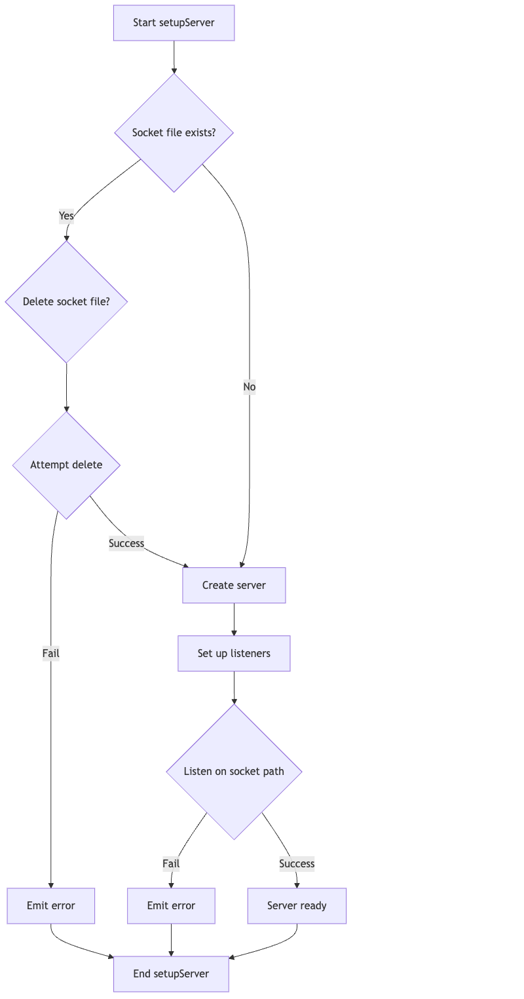
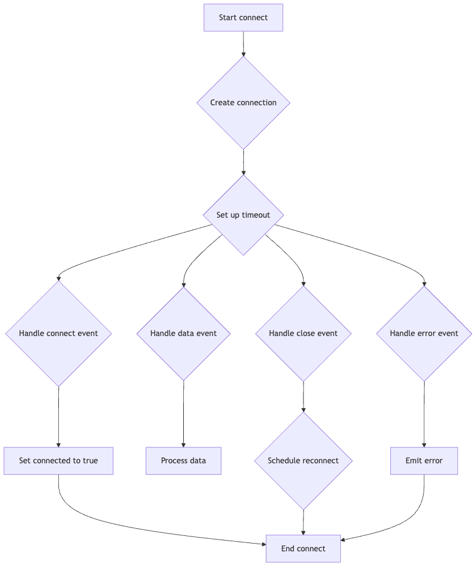
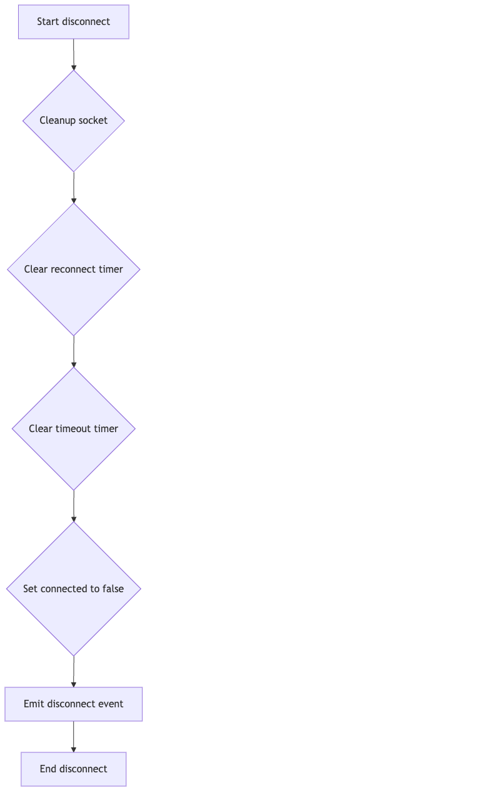
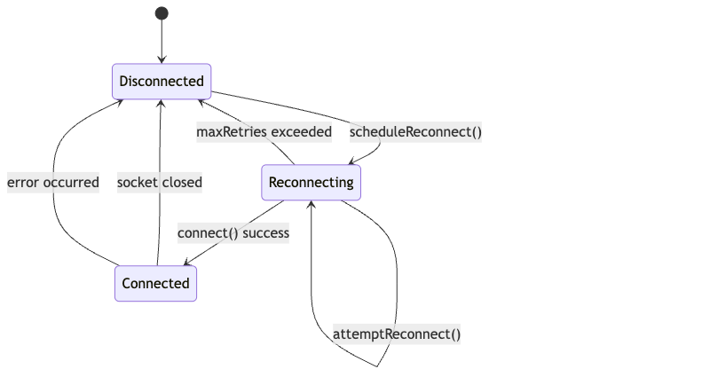

# Project | @eed_modSocketComm

## Project Description
The code defines a `NativeSocket` class for inter-process communication using Unix domain sockets or Windows named pipes. It includes a Jest test suite to ensure the `NativeSocket` class functions correctly, covering connection management, message sending/receiving, error handling, and reconnection logic. The Jest configuration file sets up the testing environment for a TypeScript project.

## Tech Stack Description
"TypeScript, Node.js, Jest"

## Features and Functions
Key features include: `NativeSocket` class with `setupServer()`, `connect()`, `disconnect()`, `emit()`, and `on()` methods; automatic reconnection logic; payload size limits; error handling; Jest unit tests covering various scenarios; Jest configuration for TypeScript projects with code coverage reporting.

## Diagrams - Flow Charts

Here are some helpful visuals to help you understand the project:

### NativeSocket Setup Server Flowchart

[NativeSocket Setup Server Flowchart](./flow-charts/NativeSocket-Setup-Server-Flowchart.png)

Full Description: 
This flowchart outlines the steps involved in setting up the `NativeSocket` server, including checking for existing socket files, creating the server, setting up listeners, and handling errors. It provides a visual representation of the server setup process.

### NativeSocket Connect Flowchart

[NativeSocket Connect Flowchart](./flow-charts/NativeSocket-Connect-Flowchart.png)

Full Description: 
This flowchart illustrates the steps involved in connecting to the `NativeSocket` server, including creating the connection, setting up timeout, and handling connection events. It provides a visual representation of the client connection process.

### NativeSocket Disconnect Flowchart

[NativeSocket Disconnect Flowchart](./flow-charts/NativeSocket-Disconnect-Flowchart.png)

Full Description: 
This flowchart outlines the steps involved in disconnecting the `NativeSocket`, including cleaning up the socket, clearing timers, and emitting the disconnect event. It provides a visual representation of the disconnection process.

### NativeSocket Reconnect State Machine

[NativeSocket Reconnect State Machine](./flow-charts/NativeSocket-Reconnect-State-Machine.png)

Full Description: 
This state machine diagram illustrates the reconnection logic of the `NativeSocket` class, including the initial disconnected state, the reconnection attempts, and the connected state. It provides a visual representation of the reconnection process.

## Project Dependencies / Modules:

## Table of Contents - Project Files

- [jest.config.js](./jest.config.js.md)

- [tests/socket.test.ts](./tests/socket.test.ts.md)

- [src/index.ts](./src/index.ts.md)

## Project/Team Context
N/A